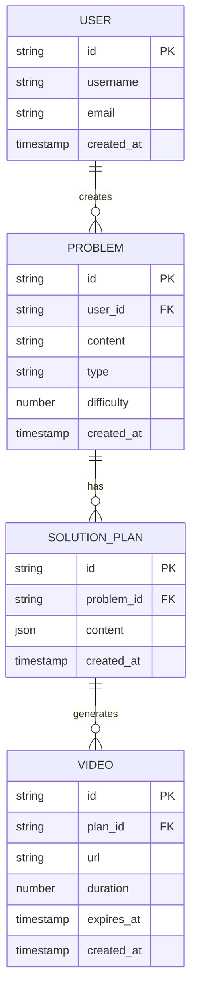

# 数据模型关系图

```mermaid
erDiagram
    USER ||--o{ PROBLEM : creates
    PROBLEM ||--o{ SOLUTION_PLAN : has
    SOLUTION_PLAN ||--o{ VIDEO : generates
    USER {
        string id PK
        string username
        string email
        timestamp created_at
    }
    PROBLEM {
        string id PK
        string user_id FK
        string content
        string type
        number difficulty
        timestamp created_at
    }
    SOLUTION_PLAN {
        string id PK
        string problem_id FK
        json content
        timestamp created_at
    }
    VIDEO {
        string id PK
        string plan_id FK
        string url
        number duration
        timestamp expires_at
        timestamp created_at
    }
``` 