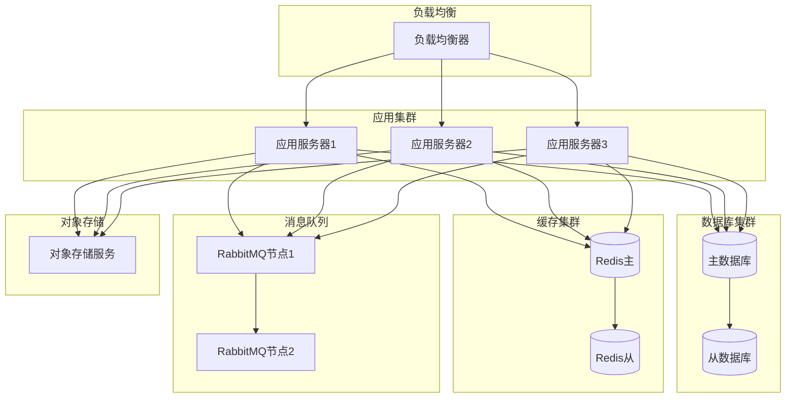

# 服务部署架构图

```mermaid
graph TB
    subgraph 负载均衡
        LB[负载均衡器]
    end

    subgraph 应用集群
        A1[应用服务器1]
        A2[应用服务器2]
        A3[应用服务器3]
    end

    subgraph 数据库集群
        DB1[(主数据库)]
        DB2[(从数据库)]
    end

    subgraph 缓存集群
        R1[(Redis主)]
        R2[(Redis从)]
    end

    subgraph 消息队列
        MQ1[RabbitMQ节点1]
        MQ2[RabbitMQ节点2]
    end

    subgraph 对象存储
        OS[对象存储服务]
    end

    LB --> A1
    LB --> A2
    LB --> A3

    A1 --> DB1
    A2 --> DB1
    A3 --> DB1
    DB1 --> DB2

    A1 --> R1
    A2 --> R1
    A3 --> R1
    R1 --> R2

    A1 --> MQ1
    A2 --> MQ1
    A3 --> MQ1
    MQ1 --> MQ2

    A1 --> OS
    A2 --> OS
    A3 --> OS
``` 