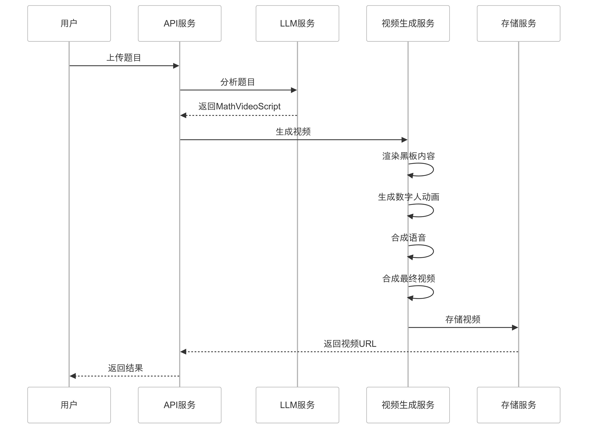
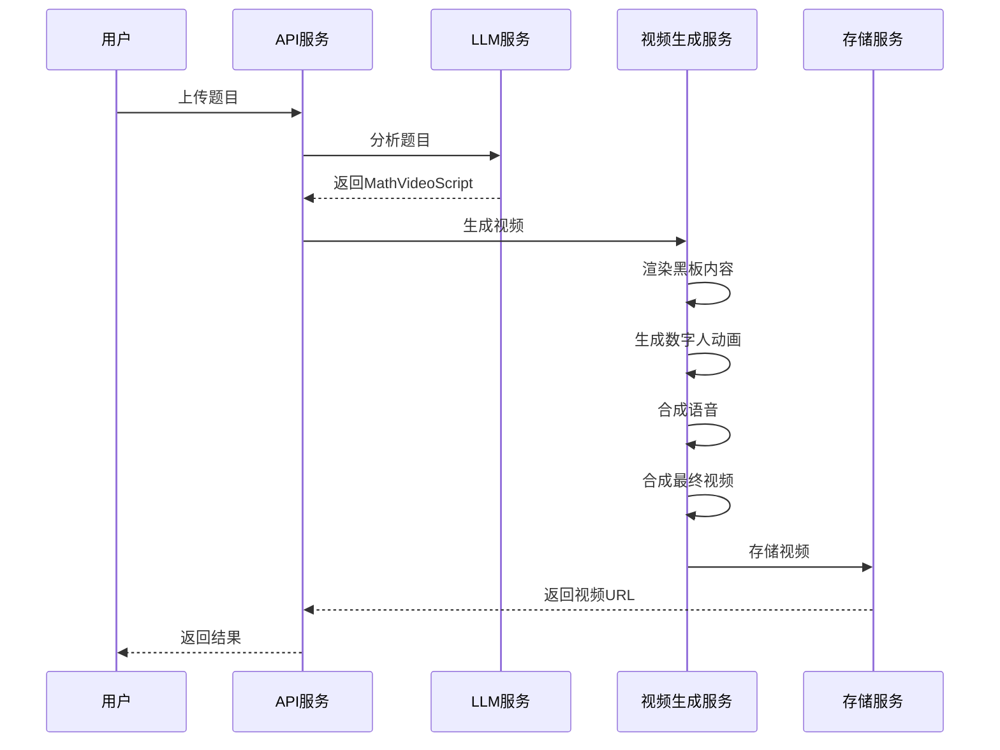

# 视频生成流程图

## 流程图（图片版本）

## 流程图（Mermaid 版本）

```mermaid
sequenceDiagram
    participant U as 用户
    participant A as API服务
    participant L as LLM服务
    participant V as 视频生成服务
    participant S as 存储服务

    U->>A: 上传题目
    A->>L: 分析题目
    L-->>A: 返回MathVideoScript
    A->>V: 生成视频
    V->>V: 渲染黑板内容
    V->>V: 生成数字人动画
    V->>V: 合成语音
    V->>V: 合成最终视频
    V->>S: 存储视频
    S-->>A: 返回视频URL
    A-->>U: 返回结果
``` 